# Visualization Pack for Intern Practice
This pack contains 30 mock visualizations (PNG) and SQL queries. Each entry includes:
- Question / analysis intent
- Recommended chart type and reason
- Placeholder demo PNG
- SQL query to produce the data
- Step-by-step how-to for Jupyter (Seaborn/Matplotlib), Power BI, and Tableau

## 1. Q01 - Protein Analysis #1
**Recommended chart type:** Horizontal Bar

**Why:** Best for comparing a small number of categories

**Placeholder demo image:**

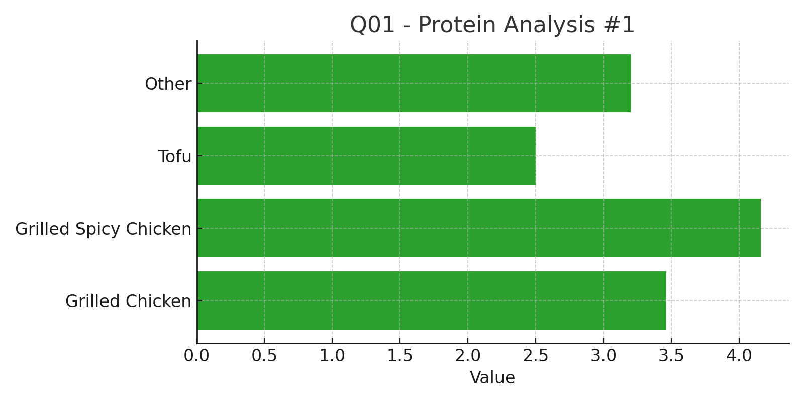

**SQL Query:**
```sql
SELECT protein_type,
       ROUND(AVG(nutrition_score), 2) AS avg_nutrition_score
FROM (
    SELECT *,
           CASE
             WHEN title ILIKE '%spicy chicken%' THEN 'Grilled Spicy Chicken'
             WHEN title ILIKE '%grilled chicken%' THEN 'Grilled Chicken'
             WHEN title ILIKE '%tofu%' THEN 'Tofu'
             ELSE 'Other'
           END AS protein_type
    FROM food_desert_db.menu_items
    WHERE atl_food_place_id = 2
) AS t
GROUP BY protein_type
ORDER BY avg_nutrition_score DESC;
```

**How to recreate (Jupyter - Seaborn / Matplotlib):**

1. Run the SQL query and load results into a pandas DataFrame `df`.
2. Example Python (adjust column names as needed):

```python
import pandas as pd
import seaborn as sns
import matplotlib.pyplot as plt

# df = result of SQL
sns.set(style='whitegrid')
plt.figure(figsize=(8,4))
# Example plotting: adjust for chart type
df_plot = df.copy()
sns.barplot(data=df_plot, x=df_plot.columns[1], y=df_plot.columns[0])
plt.title("Q01 - Protein Analysis #1")
plt.tight_layout()
plt.savefig("mock_q01.png")
plt.show()
```
**How to recreate (Power BI):**

1. In Power BI Desktop, click *Get Data* → *PostgreSQL* or paste your SQL as a source.
2. Load the query result into the model.
3. In Report view, insert a visual that matches the recommended chart type (e.g., bar chart, scatter).
4. Drag fields to Axis/Values as needed, sort, and format colors and titles.
5. Export the visual as PNG via File → Export or use the snipping tool.
**How to recreate (Tableau):**

1. Connect to the PostgreSQL data source or load CSV of the SQL result.
2. Drag the relevant dimension to Rows and measure to Columns (or use Show Me → choose chart).
3. Use filters, sorting, and formatting to match the recommended visualization.
4. Export the worksheet as an image (Worksheet → Export → Image).

---

## 2. Q02 - Protein Analysis #2
**Recommended chart type:** Vertical Bar

**Why:** Good for comparing counts or averages across categories

**Placeholder demo image:**

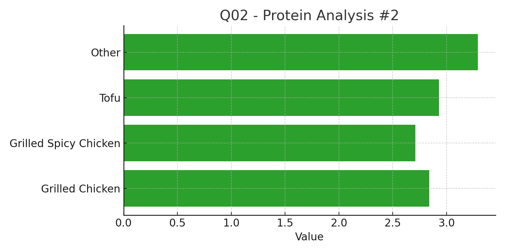

**SQL Query:**
```sql
SELECT protein_type,
       COUNT(*) AS item_count
FROM (
    SELECT *,
           CASE
             WHEN title ILIKE '%spicy chicken%' THEN 'Grilled Spicy Chicken'
             WHEN title ILIKE '%grilled chicken%' THEN 'Grilled Chicken'
             WHEN title ILIKE '%tofu%' THEN 'Tofu'
             ELSE 'Other'
           END AS protein_type
    FROM food_desert_db.menu_items
    WHERE atl_food_place_id = 2
) AS t
GROUP BY protein_type
ORDER BY item_count DESC;
```

**How to recreate (Jupyter - Seaborn / Matplotlib):**

1. Run the SQL query and load results into a pandas DataFrame `df`.
2. Example Python (adjust column names as needed):

```python
import pandas as pd
import seaborn as sns
import matplotlib.pyplot as plt

# df = result of SQL
sns.set(style='whitegrid')
plt.figure(figsize=(8,4))
# Example plotting: adjust for chart type
df_plot = df.copy()
sns.barplot(data=df_plot, x=df_plot.columns[1], y=df_plot.columns[0])
plt.title("Q02 - Protein Analysis #2")
plt.tight_layout()
plt.savefig("mock_q02.png")
plt.show()
```
**How to recreate (Power BI):**

1. In Power BI Desktop, click *Get Data* → *PostgreSQL* or paste your SQL as a source.
2. Load the query result into the model.
3. In Report view, insert a visual that matches the recommended chart type (e.g., bar chart, scatter).
4. Drag fields to Axis/Values as needed, sort, and format colors and titles.
5. Export the visual as PNG via File → Export or use the snipping tool.
**How to recreate (Tableau):**

1. Connect to the PostgreSQL data source or load CSV of the SQL result.
2. Drag the relevant dimension to Rows and measure to Columns (or use Show Me → choose chart).
3. Use filters, sorting, and formatting to match the recommended visualization.
4. Export the worksheet as an image (Worksheet → Export → Image).

---

## 3. Q03 - Protein Analysis #3
**Recommended chart type:** Table/List

**Why:** Best to show top-N items with exact values

**Placeholder demo image:**

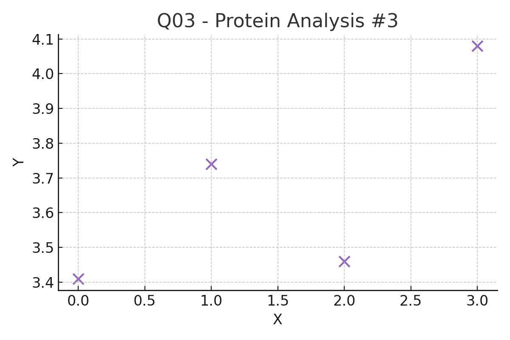

**SQL Query:**
```sql
SELECT protein_type, title, nutrition_score
FROM (
    SELECT *,
           CASE
             WHEN title ILIKE '%spicy chicken%' THEN 'Grilled Spicy Chicken'
             WHEN title ILIKE '%grilled chicken%' THEN 'Grilled Chicken'
             WHEN title ILIKE '%tofu%' THEN 'Tofu'
             ELSE 'Other'
           END AS protein_type,
           RANK() OVER (
             PARTITION BY
               CASE
                 WHEN title ILIKE '%spicy chicken%' THEN 'Grilled Spicy Chicken'
                 WHEN title ILIKE '%grilled chicken%' THEN 'Grilled Chicken'
                 WHEN title ILIKE '%tofu%' THEN 'Tofu'
                 ELSE 'Other'
               END
             ORDER BY nutrition_score DESC
           ) AS rnk
    FROM food_desert_db.menu_items
    WHERE atl_food_place_id = 2
) AS t
WHERE rnk <= 3
ORDER BY protein_type, rnk;
```

**How to recreate (Jupyter - Seaborn / Matplotlib):**

1. Run the SQL query and load results into a pandas DataFrame `df`.
2. Example Python (adjust column names as needed):

```python
import pandas as pd
import seaborn as sns
import matplotlib.pyplot as plt

# df = result of SQL
sns.set(style='whitegrid')
plt.figure(figsize=(8,4))
# Example plotting: adjust for chart type
df_plot = df.copy()
sns.barplot(data=df_plot, x=df_plot.columns[1], y=df_plot.columns[0])
plt.title("Q03 - Protein Analysis #3")
plt.tight_layout()
plt.savefig("mock_q03.png")
plt.show()
```
**How to recreate (Power BI):**

1. In Power BI Desktop, click *Get Data* → *PostgreSQL* or paste your SQL as a source.
2. Load the query result into the model.
3. In Report view, insert a visual that matches the recommended chart type (e.g., bar chart, scatter).
4. Drag fields to Axis/Values as needed, sort, and format colors and titles.
5. Export the visual as PNG via File → Export or use the snipping tool.
**How to recreate (Tableau):**

1. Connect to the PostgreSQL data source or load CSV of the SQL result.
2. Drag the relevant dimension to Rows and measure to Columns (or use Show Me → choose chart).
3. Use filters, sorting, and formatting to match the recommended visualization.
4. Export the worksheet as an image (Worksheet → Export → Image).

---

## 4. Q04 - Protein Analysis #4
**Recommended chart type:** Table/List

**Why:** Best to show bottom-N items with exact values

**Placeholder demo image:**

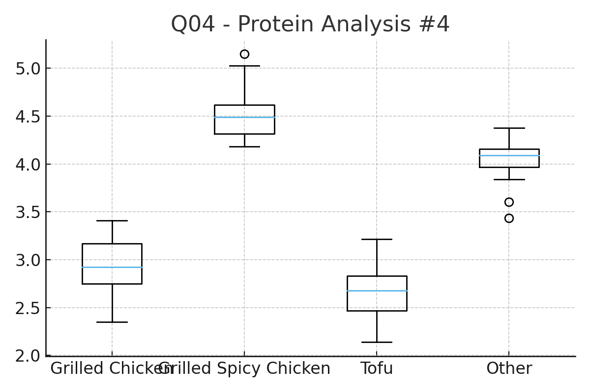

**SQL Query:**
```sql
SELECT protein_type, title, nutrition_score
FROM (
    SELECT *,
           CASE
             WHEN title ILIKE '%spicy chicken%' THEN 'Grilled Spicy Chicken'
             WHEN title ILIKE '%grilled chicken%' THEN 'Grilled Chicken'
             WHEN title ILIKE '%tofu%' THEN 'Tofu'
             ELSE 'Other'
           END AS protein_type,
           RANK() OVER (
             PARTITION BY
               CASE
                 WHEN title ILIKE '%spicy chicken%' THEN 'Grilled Spicy Chicken'
                 WHEN title ILIKE '%grilled chicken%' THEN 'Grilled Chicken'
                 WHEN title ILIKE '%tofu%' THEN 'Tofu'
                 ELSE 'Other'
               END
             ORDER BY nutrition_score ASC
           ) AS rnk
    FROM food_desert_db.menu_items
    WHERE atl_food_place_id = 2
) AS t
WHERE rnk <= 3
ORDER BY protein_type, rnk;
```

**How to recreate (Jupyter - Seaborn / Matplotlib):**

1. Run the SQL query and load results into a pandas DataFrame `df`.
2. Example Python (adjust column names as needed):

```python
import pandas as pd
import seaborn as sns
import matplotlib.pyplot as plt

# df = result of SQL
sns.set(style='whitegrid')
plt.figure(figsize=(8,4))
# Example plotting: adjust for chart type
df_plot = df.copy()
sns.barplot(data=df_plot, x=df_plot.columns[1], y=df_plot.columns[0])
plt.title("Q04 - Protein Analysis #4")
plt.tight_layout()
plt.savefig("mock_q04.png")
plt.show()
```
**How to recreate (Power BI):**

1. In Power BI Desktop, click *Get Data* → *PostgreSQL* or paste your SQL as a source.
2. Load the query result into the model.
3. In Report view, insert a visual that matches the recommended chart type (e.g., bar chart, scatter).
4. Drag fields to Axis/Values as needed, sort, and format colors and titles.
5. Export the visual as PNG via File → Export or use the snipping tool.
**How to recreate (Tableau):**

1. Connect to the PostgreSQL data source or load CSV of the SQL result.
2. Drag the relevant dimension to Rows and measure to Columns (or use Show Me → choose chart).
3. Use filters, sorting, and formatting to match the recommended visualization.
4. Export the worksheet as an image (Worksheet → Export → Image).

---

## 5. Q05 - Protein Analysis #5
**Recommended chart type:** Horizontal Bar

**Why:** Average values across categories are easy to read as bars

**Placeholder demo image:**

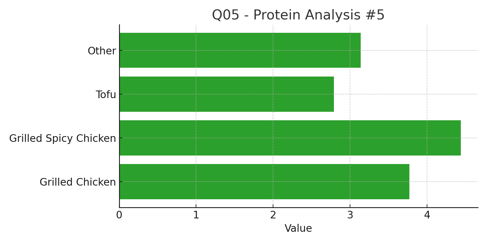

**SQL Query:**
```sql
SELECT protein_type,
       ROUND(AVG(calories), 0) AS avg_calories
FROM (
    SELECT *,
           CASE
             WHEN title ILIKE '%spicy chicken%' THEN 'Grilled Spicy Chicken'
             WHEN title ILIKE '%grilled chicken%' THEN 'Grilled Chicken'
             WHEN title ILIKE '%tofu%' THEN 'Tofu'
             ELSE 'Other'
           END AS protein_type
    FROM food_desert_db.menu_items
    WHERE atl_food_place_id = 2
) AS t
GROUP BY protein_type
ORDER BY avg_calories;
```

**How to recreate (Jupyter - Seaborn / Matplotlib):**

1. Run the SQL query and load results into a pandas DataFrame `df`.
2. Example Python (adjust column names as needed):

```python
import pandas as pd
import seaborn as sns
import matplotlib.pyplot as plt

# df = result of SQL
sns.set(style='whitegrid')
plt.figure(figsize=(8,4))
# Example plotting: adjust for chart type
df_plot = df.copy()
sns.barplot(data=df_plot, x=df_plot.columns[1], y=df_plot.columns[0])
plt.title("Q05 - Protein Analysis #5")
plt.tight_layout()
plt.savefig("mock_q05.png")
plt.show()
```
**How to recreate (Power BI):**

1. In Power BI Desktop, click *Get Data* → *PostgreSQL* or paste your SQL as a source.
2. Load the query result into the model.
3. In Report view, insert a visual that matches the recommended chart type (e.g., bar chart, scatter).
4. Drag fields to Axis/Values as needed, sort, and format colors and titles.
5. Export the visual as PNG via File → Export or use the snipping tool.
**How to recreate (Tableau):**

1. Connect to the PostgreSQL data source or load CSV of the SQL result.
2. Drag the relevant dimension to Rows and measure to Columns (or use Show Me → choose chart).
3. Use filters, sorting, and formatting to match the recommended visualization.
4. Export the worksheet as an image (Worksheet → Export → Image).

---

## 6. Q06 - Protein Analysis #6
**Recommended chart type:** Horizontal Bar

**Why:** Comparing average grams of protein across protein types

**Placeholder demo image:**

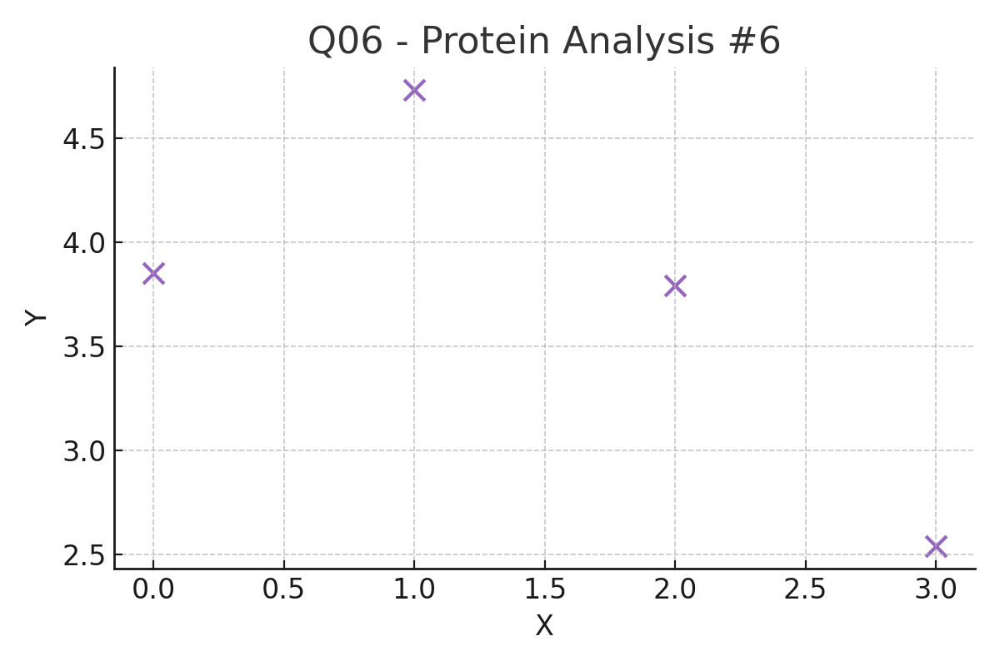

**SQL Query:**
```sql
SELECT protein_type,
       ROUND(AVG(protein_g), 1) AS avg_protein_g
FROM (
    SELECT *,
           CASE
             WHEN title ILIKE '%spicy chicken%' THEN 'Grilled Spicy Chicken'
             WHEN title ILIKE '%grilled chicken%' THEN 'Grilled Chicken'
             WHEN title ILIKE '%tofu%' THEN 'Tofu'
             ELSE 'Other'
           END AS protein_type
    FROM food_desert_db.menu_items
    WHERE atl_food_place_id = 2
) AS t
GROUP BY protein_type
ORDER BY avg_protein_g DESC;
```

**How to recreate (Jupyter - Seaborn / Matplotlib):**

1. Run the SQL query and load results into a pandas DataFrame `df`.
2. Example Python (adjust column names as needed):

```python
import pandas as pd
import seaborn as sns
import matplotlib.pyplot as plt

# df = result of SQL
sns.set(style='whitegrid')
plt.figure(figsize=(8,4))
# Example plotting: adjust for chart type
df_plot = df.copy()
sns.barplot(data=df_plot, x=df_plot.columns[1], y=df_plot.columns[0])
plt.title("Q06 - Protein Analysis #6")
plt.tight_layout()
plt.savefig("mock_q06.png")
plt.show()
```
**How to recreate (Power BI):**

1. In Power BI Desktop, click *Get Data* → *PostgreSQL* or paste your SQL as a source.
2. Load the query result into the model.
3. In Report view, insert a visual that matches the recommended chart type (e.g., bar chart, scatter).
4. Drag fields to Axis/Values as needed, sort, and format colors and titles.
5. Export the visual as PNG via File → Export or use the snipping tool.
**How to recreate (Tableau):**

1. Connect to the PostgreSQL data source or load CSV of the SQL result.
2. Drag the relevant dimension to Rows and measure to Columns (or use Show Me → choose chart).
3. Use filters, sorting, and formatting to match the recommended visualization.
4. Export the worksheet as an image (Worksheet → Export → Image).

---

## 7. Q07 - Protein Analysis #7
**Recommended chart type:** Scatter

**Why:** Shows protein-per-calorie efficiency vs items

**Placeholder demo image:**

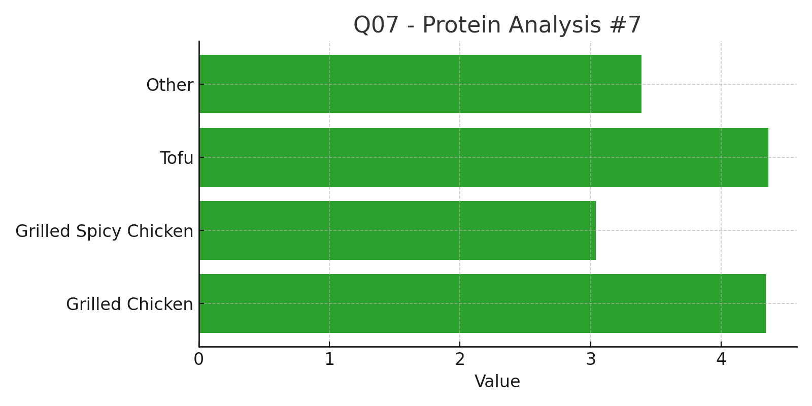

**SQL Query:**
```sql
SELECT protein_type,
       title,
       ROUND(protein_g::numeric / calories, 3) AS protein_per_cal
FROM (
    SELECT *,
           CASE
             WHEN title ILIKE '%spicy chicken%' THEN 'Grilled Spicy Chicken'
             WHEN title ILIKE '%grilled chicken%' THEN 'Grilled Chicken'
             WHEN title ILIKE '%tofu%' THEN 'Tofu'
             ELSE 'Other'
           END AS protein_type,
           RANK() OVER (
             PARTITION BY
               CASE
                 WHEN title ILIKE '%spicy chicken%' THEN 'Grilled Spicy Chicken'
                 WHEN title ILIKE '%grilled chicken%' THEN 'Grilled Chicken'
                 WHEN title ILIKE '%tofu%' THEN 'Tofu'
                 ELSE 'Other'
               END
             ORDER BY (protein_g::numeric / calories) DESC
           ) AS rnk
    FROM food_desert_db.menu_items
    WHERE atl_food_place_id = 2
) AS t
WHERE rnk = 1;
```

**How to recreate (Jupyter - Seaborn / Matplotlib):**

1. Run the SQL query and load results into a pandas DataFrame `df`.
2. Example Python (adjust column names as needed):

```python
import pandas as pd
import seaborn as sns
import matplotlib.pyplot as plt

# df = result of SQL
sns.set(style='whitegrid')
plt.figure(figsize=(8,4))
# Example plotting: adjust for chart type
df_plot = df.copy()
sns.barplot(data=df_plot, x=df_plot.columns[1], y=df_plot.columns[0])
plt.title("Q07 - Protein Analysis #7")
plt.tight_layout()
plt.savefig("mock_q07.png")
plt.show()
```
**How to recreate (Power BI):**

1. In Power BI Desktop, click *Get Data* → *PostgreSQL* or paste your SQL as a source.
2. Load the query result into the model.
3. In Report view, insert a visual that matches the recommended chart type (e.g., bar chart, scatter).
4. Drag fields to Axis/Values as needed, sort, and format colors and titles.
5. Export the visual as PNG via File → Export or use the snipping tool.
**How to recreate (Tableau):**

1. Connect to the PostgreSQL data source or load CSV of the SQL result.
2. Drag the relevant dimension to Rows and measure to Columns (or use Show Me → choose chart).
3. Use filters, sorting, and formatting to match the recommended visualization.
4. Export the worksheet as an image (Worksheet → Export → Image).

---

## 8. Q08 - Protein Analysis #8
**Recommended chart type:** Stacked Bar

**Why:** Shows percent of items meeting a threshold by category

**Placeholder demo image:**

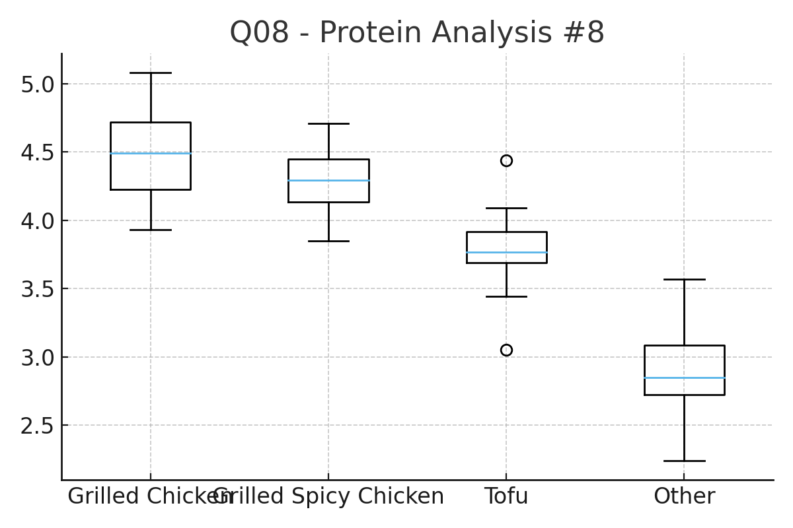

**SQL Query:**
```sql
SELECT protein_type,
       ROUND(100.0 * SUM(CASE WHEN nutrition_score >= 4 THEN 1 ELSE 0 END) / COUNT(*), 1)
         AS pct_high_nutrition
FROM (
    SELECT *,
           CASE
             WHEN title ILIKE '%spicy chicken%' THEN 'Grilled Spicy Chicken'
             WHEN title ILIKE '%grilled chicken%' THEN 'Grilled Chicken'
             WHEN title ILIKE '%tofu%' THEN 'Tofu'
             ELSE 'Other'
           END AS protein_type
    FROM food_desert_db.menu_items
    WHERE atl_food_place_id = 2
) AS t
GROUP BY protein_type;
```

**How to recreate (Jupyter - Seaborn / Matplotlib):**

1. Run the SQL query and load results into a pandas DataFrame `df`.
2. Example Python (adjust column names as needed):

```python
import pandas as pd
import seaborn as sns
import matplotlib.pyplot as plt

# df = result of SQL
sns.set(style='whitegrid')
plt.figure(figsize=(8,4))
# Example plotting: adjust for chart type
df_plot = df.copy()
sns.barplot(data=df_plot, x=df_plot.columns[1], y=df_plot.columns[0])
plt.title("Q08 - Protein Analysis #8")
plt.tight_layout()
plt.savefig("mock_q08.png")
plt.show()
```
**How to recreate (Power BI):**

1. In Power BI Desktop, click *Get Data* → *PostgreSQL* or paste your SQL as a source.
2. Load the query result into the model.
3. In Report view, insert a visual that matches the recommended chart type (e.g., bar chart, scatter).
4. Drag fields to Axis/Values as needed, sort, and format colors and titles.
5. Export the visual as PNG via File → Export or use the snipping tool.
**How to recreate (Tableau):**

1. Connect to the PostgreSQL data source or load CSV of the SQL result.
2. Drag the relevant dimension to Rows and measure to Columns (or use Show Me → choose chart).
3. Use filters, sorting, and formatting to match the recommended visualization.
4. Export the worksheet as an image (Worksheet → Export → Image).

---

## 9. Q09 - Protein Analysis #9
**Recommended chart type:** Horizontal Bar

**Why:** Compare average sodium across protein types

**Placeholder demo image:**

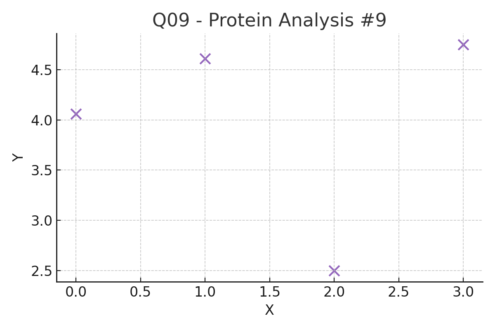

**SQL Query:**
```sql
SELECT protein_type,
       ROUND(AVG(sodium_mg), 0) AS avg_sodium_mg
FROM (
    SELECT *,
           CASE
             WHEN title ILIKE '%spicy chicken%' THEN 'Grilled Spicy Chicken'
             WHEN title ILIKE '%grilled chicken%' THEN 'Grilled Chicken'
             WHEN title ILIKE '%tofu%' THEN 'Tofu'
             ELSE 'Other'
           END AS protein_type
    FROM food_desert_db.menu_items
    WHERE atl_food_place_id = 2
) AS t
GROUP BY protein_type
ORDER BY avg_sodium_mg;
```

**How to recreate (Jupyter - Seaborn / Matplotlib):**

1. Run the SQL query and load results into a pandas DataFrame `df`.
2. Example Python (adjust column names as needed):

```python
import pandas as pd
import seaborn as sns
import matplotlib.pyplot as plt

# df = result of SQL
sns.set(style='whitegrid')
plt.figure(figsize=(8,4))
# Example plotting: adjust for chart type
df_plot = df.copy()
sns.barplot(data=df_plot, x=df_plot.columns[1], y=df_plot.columns[0])
plt.title("Q09 - Protein Analysis #9")
plt.tight_layout()
plt.savefig("mock_q09.png")
plt.show()
```
**How to recreate (Power BI):**

1. In Power BI Desktop, click *Get Data* → *PostgreSQL* or paste your SQL as a source.
2. Load the query result into the model.
3. In Report view, insert a visual that matches the recommended chart type (e.g., bar chart, scatter).
4. Drag fields to Axis/Values as needed, sort, and format colors and titles.
5. Export the visual as PNG via File → Export or use the snipping tool.
**How to recreate (Tableau):**

1. Connect to the PostgreSQL data source or load CSV of the SQL result.
2. Drag the relevant dimension to Rows and measure to Columns (or use Show Me → choose chart).
3. Use filters, sorting, and formatting to match the recommended visualization.
4. Export the worksheet as an image (Worksheet → Export → Image).

---

## 10. Q10 - Protein Analysis #10
**Recommended chart type:** Horizontal Bar

**Why:** Composite score comparison

**Placeholder demo image:**

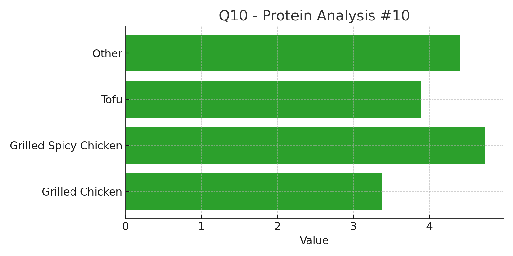

**SQL Query:**
```sql
SELECT protein_type,
       ROUND(AVG(nutrition_score - GREATEST((calories - 600)/200.0, 0)), 2)
         AS composite_score
FROM (
    SELECT *,
           CASE
             WHEN title ILIKE '%spicy chicken%' THEN 'Grilled Spicy Chicken'
             WHEN title ILIKE '%grilled chicken%' THEN 'Grilled Chicken'
             WHEN title ILIKE '%tofu%' THEN 'Tofu'
             ELSE 'Other'
           END AS protein_type
    FROM food_desert_db.menu_items
    WHERE atl_food_place_id = 2
) AS t
GROUP BY protein_type
ORDER BY composite_score DESC;
```

**How to recreate (Jupyter - Seaborn / Matplotlib):**

1. Run the SQL query and load results into a pandas DataFrame `df`.
2. Example Python (adjust column names as needed):

```python
import pandas as pd
import seaborn as sns
import matplotlib.pyplot as plt

# df = result of SQL
sns.set(style='whitegrid')
plt.figure(figsize=(8,4))
# Example plotting: adjust for chart type
df_plot = df.copy()
sns.barplot(data=df_plot, x=df_plot.columns[1], y=df_plot.columns[0])
plt.title("Q10 - Protein Analysis #10")
plt.tight_layout()
plt.savefig("mock_q10.png")
plt.show()
```
**How to recreate (Power BI):**

1. In Power BI Desktop, click *Get Data* → *PostgreSQL* or paste your SQL as a source.
2. Load the query result into the model.
3. In Report view, insert a visual that matches the recommended chart type (e.g., bar chart, scatter).
4. Drag fields to Axis/Values as needed, sort, and format colors and titles.
5. Export the visual as PNG via File → Export or use the snipping tool.
**How to recreate (Tableau):**

1. Connect to the PostgreSQL data source or load CSV of the SQL result.
2. Drag the relevant dimension to Rows and measure to Columns (or use Show Me → choose chart).
3. Use filters, sorting, and formatting to match the recommended visualization.
4. Export the worksheet as an image (Worksheet → Export → Image).

---

## 11. Q11 - Base Analysis #1
**Recommended chart type:** Vertical Bar

**Why:** Appropriate for comparing base categories

**Placeholder demo image:**

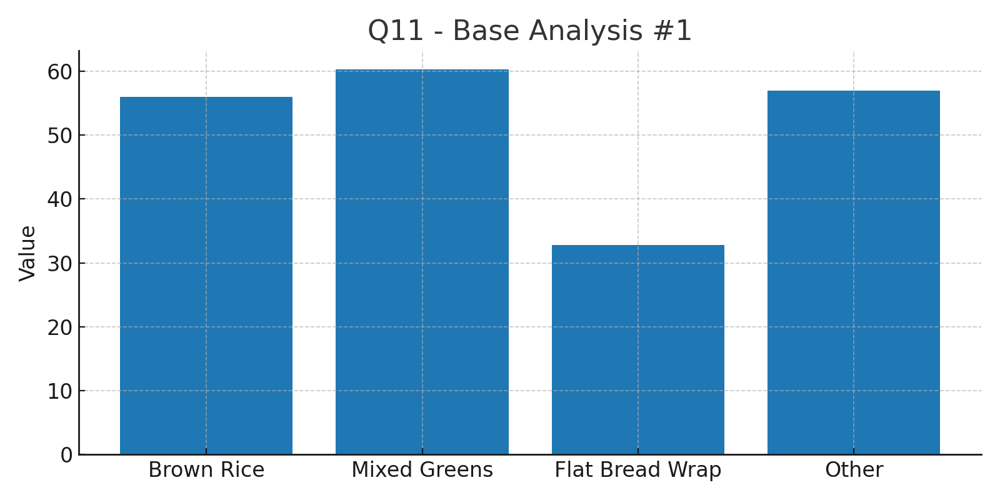

**SQL Query:**
```sql
SELECT base_type,
       ROUND(100.0 * SUM(CASE WHEN nutrition_score >= 4 THEN 1 ELSE 0 END)
             / COUNT(*), 1) AS pct_high_nutrition
FROM (
    SELECT *,
           CASE
             WHEN title ILIKE '%brown rice%' THEN 'Brown Rice'
             WHEN title ILIKE '%mixed greens%' THEN 'Mixed Greens'
             WHEN title ILIKE '%flat bread wrap%' THEN 'Flat Bread Wrap'
             ELSE 'Other'
           END AS base_type
    FROM food_desert_db.menu_items
    WHERE atl_food_place_id = 2
) AS t
GROUP BY base_type;
```

**How to recreate (Jupyter - Seaborn / Matplotlib):**

1. Run the SQL query and load results into a pandas DataFrame `df`.
2. Example Python (adjust column names as needed):

```python
import pandas as pd
import seaborn as sns
import matplotlib.pyplot as plt

# df = result of SQL
sns.set(style='whitegrid')
plt.figure(figsize=(8,4))
# Example plotting: adjust for chart type
df_plot = df.copy()
sns.barplot(data=df_plot, x=df_plot.columns[1], y=df_plot.columns[0])
plt.title("Q11 - Base Analysis #1")
plt.tight_layout()
plt.savefig("mock_q11.png")
plt.show()
```
**How to recreate (Power BI):**

1. In Power BI Desktop, click *Get Data* → *PostgreSQL* or paste your SQL as a source.
2. Load the query result into the model.
3. In Report view, insert a visual that matches the recommended chart type (e.g., bar chart, scatter).
4. Drag fields to Axis/Values as needed, sort, and format colors and titles.
5. Export the visual as PNG via File → Export or use the snipping tool.
**How to recreate (Tableau):**

1. Connect to the PostgreSQL data source or load CSV of the SQL result.
2. Drag the relevant dimension to Rows and measure to Columns (or use Show Me → choose chart).
3. Use filters, sorting, and formatting to match the recommended visualization.
4. Export the worksheet as an image (Worksheet → Export → Image).

---

## 12. Q12 - Base Analysis #2
**Recommended chart type:** Horizontal Bar

**Why:** Appropriate for comparing base categories

**Placeholder demo image:**

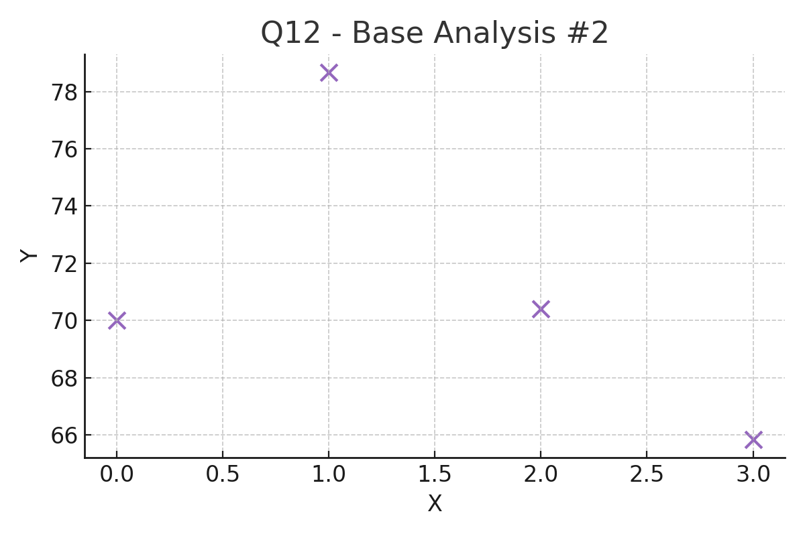

**SQL Query:**
```sql
SELECT base_type,
       ROUND(AVG(nutrition_score), 2) AS avg_nutrition_score
FROM (
    SELECT *,
           CASE
             WHEN title ILIKE '%brown rice%' THEN 'Brown Rice'
             WHEN title ILIKE '%mixed greens%' THEN 'Mixed Greens'
             WHEN title ILIKE '%flat bread wrap%' THEN 'Flat Bread Wrap'
             ELSE 'Other'
           END AS base_type
    FROM food_desert_db.menu_items
    WHERE atl_food_place_id = 2
) AS t
GROUP BY base_type
ORDER BY avg_nutrition_score DESC;
```

**How to recreate (Jupyter - Seaborn / Matplotlib):**

1. Run the SQL query and load results into a pandas DataFrame `df`.
2. Example Python (adjust column names as needed):

```python
import pandas as pd
import seaborn as sns
import matplotlib.pyplot as plt

# df = result of SQL
sns.set(style='whitegrid')
plt.figure(figsize=(8,4))
# Example plotting: adjust for chart type
df_plot = df.copy()
sns.barplot(data=df_plot, x=df_plot.columns[1], y=df_plot.columns[0])
plt.title("Q12 - Base Analysis #2")
plt.tight_layout()
plt.savefig("mock_q12.png")
plt.show()
```
**How to recreate (Power BI):**

1. In Power BI Desktop, click *Get Data* → *PostgreSQL* or paste your SQL as a source.
2. Load the query result into the model.
3. In Report view, insert a visual that matches the recommended chart type (e.g., bar chart, scatter).
4. Drag fields to Axis/Values as needed, sort, and format colors and titles.
5. Export the visual as PNG via File → Export or use the snipping tool.
**How to recreate (Tableau):**

1. Connect to the PostgreSQL data source or load CSV of the SQL result.
2. Drag the relevant dimension to Rows and measure to Columns (or use Show Me → choose chart).
3. Use filters, sorting, and formatting to match the recommended visualization.
4. Export the worksheet as an image (Worksheet → Export → Image).

---

## 13. Q13 - Base Analysis #3
**Recommended chart type:** Table/List

**Why:** Appropriate for comparing base categories

**Placeholder demo image:**

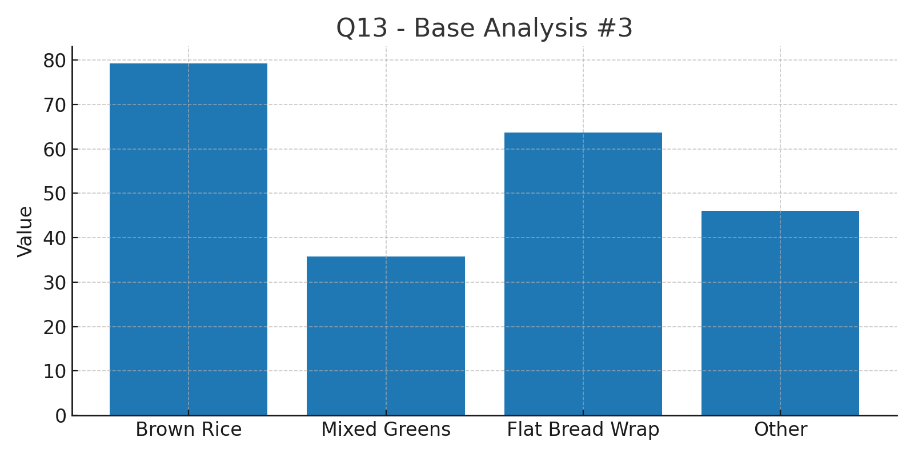

**SQL Query:**
```sql
SELECT base_type,
       COUNT(*) AS item_count
FROM (
    SELECT *,
           CASE
             WHEN title ILIKE '%brown rice%' THEN 'Brown Rice'
             WHEN title ILIKE '%mixed greens%' THEN 'Mixed Greens'
             WHEN title ILIKE '%flat bread wrap%' THEN 'Flat Bread Wrap'
             ELSE 'Other'
           END AS base_type
    FROM food_desert_db.menu_items
    WHERE atl_food_place_id = 2
) AS t
GROUP BY base_type
ORDER BY item_count DESC;
```

**How to recreate (Jupyter - Seaborn / Matplotlib):**

1. Run the SQL query and load results into a pandas DataFrame `df`.
2. Example Python (adjust column names as needed):

```python
import pandas as pd
import seaborn as sns
import matplotlib.pyplot as plt

# df = result of SQL
sns.set(style='whitegrid')
plt.figure(figsize=(8,4))
# Example plotting: adjust for chart type
df_plot = df.copy()
sns.barplot(data=df_plot, x=df_plot.columns[1], y=df_plot.columns[0])
plt.title("Q13 - Base Analysis #3")
plt.tight_layout()
plt.savefig("mock_q13.png")
plt.show()
```
**How to recreate (Power BI):**

1. In Power BI Desktop, click *Get Data* → *PostgreSQL* or paste your SQL as a source.
2. Load the query result into the model.
3. In Report view, insert a visual that matches the recommended chart type (e.g., bar chart, scatter).
4. Drag fields to Axis/Values as needed, sort, and format colors and titles.
5. Export the visual as PNG via File → Export or use the snipping tool.
**How to recreate (Tableau):**

1. Connect to the PostgreSQL data source or load CSV of the SQL result.
2. Drag the relevant dimension to Rows and measure to Columns (or use Show Me → choose chart).
3. Use filters, sorting, and formatting to match the recommended visualization.
4. Export the worksheet as an image (Worksheet → Export → Image).

---

## 14. Q14 - Base Analysis #4
**Recommended chart type:** Top-N List

**Why:** Appropriate for comparing base categories

**Placeholder demo image:**

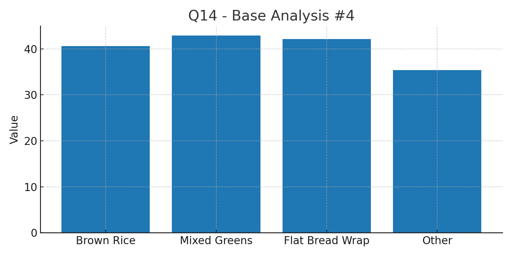

**SQL Query:**
```sql
SELECT base_type,
       title,
       nutrition_score
FROM (
    SELECT *,
           CASE
             WHEN title ILIKE '%brown rice%' THEN 'Brown Rice'
             WHEN title ILIKE '%mixed greens%' THEN 'Mixed Greens'
             WHEN title ILIKE '%flat bread wrap%' THEN 'Flat Bread Wrap'
             ELSE 'Other'
           END AS base_type,
           RANK() OVER (
               PARTITION BY
                 CASE
                   WHEN title ILIKE '%brown rice%' THEN 'Brown Rice'
                   WHEN title ILIKE '%mixed greens%' THEN 'Mixed Greens'
                   WHEN title ILIKE '%flat bread wrap%' THEN 'Flat Bread Wrap'
                   ELSE 'Other'
                 END
               ORDER BY nutrition_score DESC
           ) AS rnk
    FROM food_desert_db.menu_items
    WHERE atl_food_place_id = 2
) AS t
WHERE rnk <= 3
ORDER BY base_type, rnk;
```

**How to recreate (Jupyter - Seaborn / Matplotlib):**

1. Run the SQL query and load results into a pandas DataFrame `df`.
2. Example Python (adjust column names as needed):

```python
import pandas as pd
import seaborn as sns
import matplotlib.pyplot as plt

# df = result of SQL
sns.set(style='whitegrid')
plt.figure(figsize=(8,4))
# Example plotting: adjust for chart type
df_plot = df.copy()
sns.barplot(data=df_plot, x=df_plot.columns[1], y=df_plot.columns[0])
plt.title("Q14 - Base Analysis #4")
plt.tight_layout()
plt.savefig("mock_q14.png")
plt.show()
```
**How to recreate (Power BI):**

1. In Power BI Desktop, click *Get Data* → *PostgreSQL* or paste your SQL as a source.
2. Load the query result into the model.
3. In Report view, insert a visual that matches the recommended chart type (e.g., bar chart, scatter).
4. Drag fields to Axis/Values as needed, sort, and format colors and titles.
5. Export the visual as PNG via File → Export or use the snipping tool.
**How to recreate (Tableau):**

1. Connect to the PostgreSQL data source or load CSV of the SQL result.
2. Drag the relevant dimension to Rows and measure to Columns (or use Show Me → choose chart).
3. Use filters, sorting, and formatting to match the recommended visualization.
4. Export the worksheet as an image (Worksheet → Export → Image).

---

## 15. Q15 - Base Analysis #5
**Recommended chart type:** Bottom-N List

**Why:** Appropriate for comparing base categories

**Placeholder demo image:**

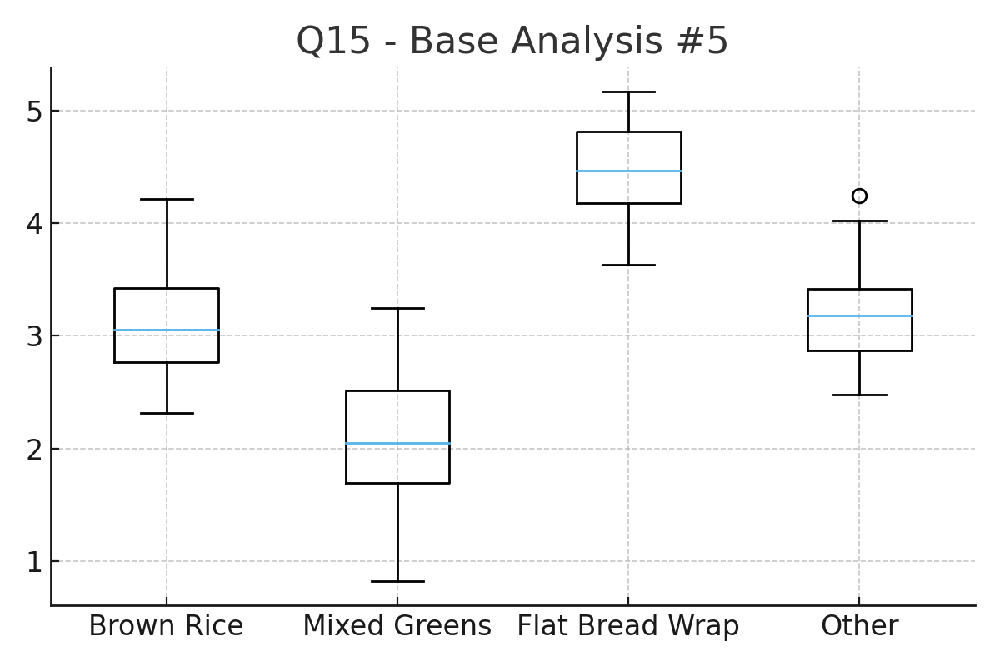

**SQL Query:**
```sql
SELECT base_type,
       title,
       nutrition_score
FROM (
    SELECT *,
           CASE
             WHEN title ILIKE '%brown rice%' THEN 'Brown Rice'
             WHEN title ILIKE '%mixed greens%' THEN 'Mixed Greens'
             WHEN title ILIKE '%flat bread wrap%' THEN 'Flat Bread Wrap'
             ELSE 'Other'
           END AS base_type,
           RANK() OVER (
               PARTITION BY
                 CASE
                   WHEN title ILIKE '%brown rice%' THEN 'Brown Rice'
                   WHEN title ILIKE '%mixed greens%' THEN 'Mixed Greens'
                   WHEN title ILIKE '%flat bread wrap%' THEN 'Flat Bread Wrap'
                   ELSE 'Other'
                 END
               ORDER BY nutrition_score ASC
           ) AS rnk
    FROM food_desert_db.menu_items
    WHERE atl_food_place_id = 2
) AS t
WHERE rnk <= 3
ORDER BY base_type, rnk;
```

**How to recreate (Jupyter - Seaborn / Matplotlib):**

1. Run the SQL query and load results into a pandas DataFrame `df`.
2. Example Python (adjust column names as needed):

```python
import pandas as pd
import seaborn as sns
import matplotlib.pyplot as plt

# df = result of SQL
sns.set(style='whitegrid')
plt.figure(figsize=(8,4))
# Example plotting: adjust for chart type
df_plot = df.copy()
sns.barplot(data=df_plot, x=df_plot.columns[1], y=df_plot.columns[0])
plt.title("Q15 - Base Analysis #5")
plt.tight_layout()
plt.savefig("mock_q15.png")
plt.show()
```
**How to recreate (Power BI):**

1. In Power BI Desktop, click *Get Data* → *PostgreSQL* or paste your SQL as a source.
2. Load the query result into the model.
3. In Report view, insert a visual that matches the recommended chart type (e.g., bar chart, scatter).
4. Drag fields to Axis/Values as needed, sort, and format colors and titles.
5. Export the visual as PNG via File → Export or use the snipping tool.
**How to recreate (Tableau):**

1. Connect to the PostgreSQL data source or load CSV of the SQL result.
2. Drag the relevant dimension to Rows and measure to Columns (or use Show Me → choose chart).
3. Use filters, sorting, and formatting to match the recommended visualization.
4. Export the worksheet as an image (Worksheet → Export → Image).

---

## 16. Q16 - Base Analysis #6
**Recommended chart type:** Horizontal Bar

**Why:** Appropriate for comparing base categories

**Placeholder demo image:**

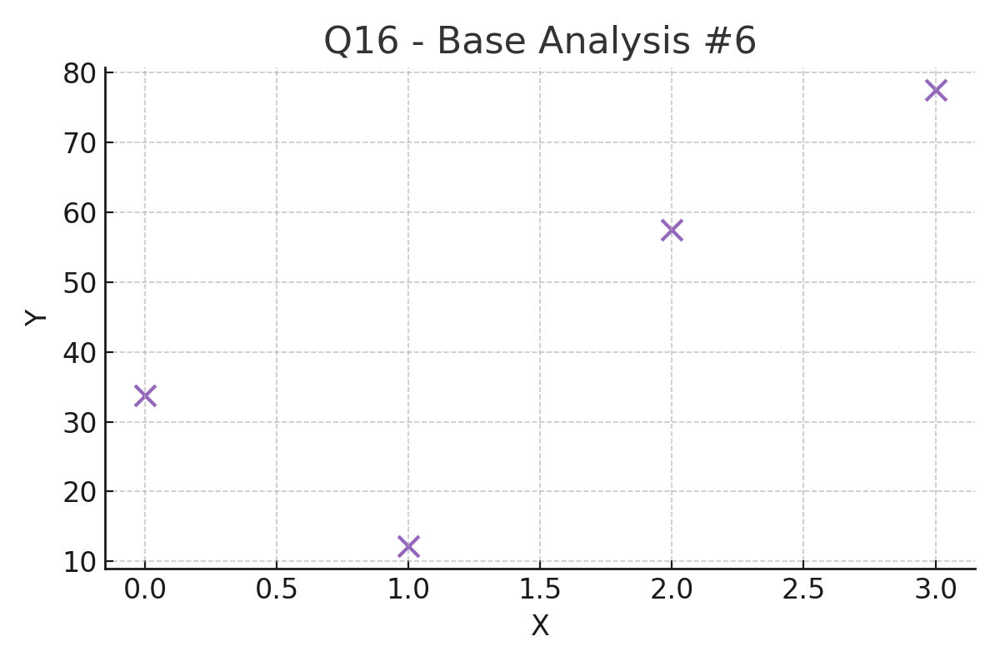

**SQL Query:**
```sql
SELECT base_type,
       title,
       ROUND(protein_g::numeric / calories, 3) AS protein_per_cal
FROM (
    SELECT *,
           CASE
             WHEN title ILIKE '%brown rice%' THEN 'Brown Rice'
             WHEN title ILIKE '%mixed greens%' THEN 'Mixed Greens'
             WHEN title ILIKE '%flat bread wrap%' THEN 'Flat Bread Wrap'
             ELSE 'Other'
           END AS base_type,
           RANK() OVER (
               PARTITION BY
                 CASE
                   WHEN title ILIKE '%brown rice%' THEN 'Brown Rice'
                   WHEN title ILIKE '%mixed greens%' THEN 'Mixed Greens'
                   WHEN title ILIKE '%flat bread wrap%' THEN 'Flat Bread Wrap'
                   ELSE 'Other'
                 END
               ORDER BY (protein_g::numeric / calories) DESC
           ) AS rnk
    FROM food_desert_db.menu_items
    WHERE atl_food_place_id = 2
) AS t
WHERE rnk = 1;
```

**How to recreate (Jupyter - Seaborn / Matplotlib):**

1. Run the SQL query and load results into a pandas DataFrame `df`.
2. Example Python (adjust column names as needed):

```python
import pandas as pd
import seaborn as sns
import matplotlib.pyplot as plt

# df = result of SQL
sns.set(style='whitegrid')
plt.figure(figsize=(8,4))
# Example plotting: adjust for chart type
df_plot = df.copy()
sns.barplot(data=df_plot, x=df_plot.columns[1], y=df_plot.columns[0])
plt.title("Q16 - Base Analysis #6")
plt.tight_layout()
plt.savefig("mock_q16.png")
plt.show()
```
**How to recreate (Power BI):**

1. In Power BI Desktop, click *Get Data* → *PostgreSQL* or paste your SQL as a source.
2. Load the query result into the model.
3. In Report view, insert a visual that matches the recommended chart type (e.g., bar chart, scatter).
4. Drag fields to Axis/Values as needed, sort, and format colors and titles.
5. Export the visual as PNG via File → Export or use the snipping tool.
**How to recreate (Tableau):**

1. Connect to the PostgreSQL data source or load CSV of the SQL result.
2. Drag the relevant dimension to Rows and measure to Columns (or use Show Me → choose chart).
3. Use filters, sorting, and formatting to match the recommended visualization.
4. Export the worksheet as an image (Worksheet → Export → Image).

---

## 17. Q17 - Base Analysis #7
**Recommended chart type:** Horizontal Bar

**Why:** Appropriate for comparing base categories

**Placeholder demo image:**

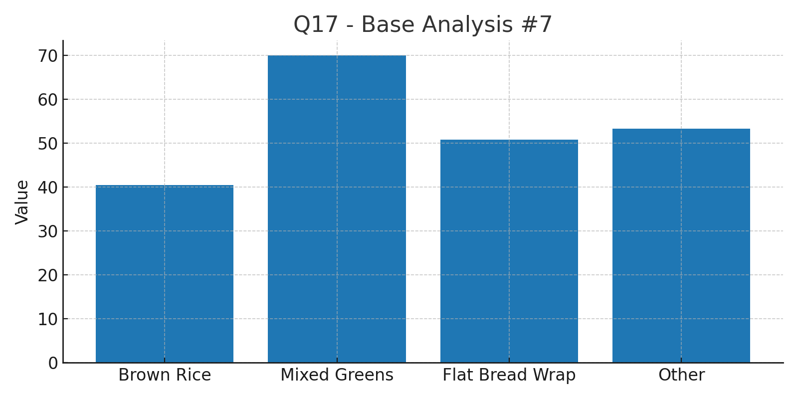

**SQL Query:**
```sql
SELECT base_type,
       ROUND(AVG(sodium_mg), 0) AS avg_sodium_mg
FROM (
    SELECT *,
           CASE
             WHEN title ILIKE '%brown rice%' THEN 'Brown Rice'
             WHEN title ILIKE '%mixed greens%' THEN 'Mixed Greens'
             WHEN title ILIKE '%flat bread wrap%' THEN 'Flat Bread Wrap'
             ELSE 'Other'
           END AS base_type
    FROM food_desert_db.menu_items
    WHERE atl_food_place_id = 2
) AS t
GROUP BY base_type
ORDER BY avg_sodium_mg;
```

**How to recreate (Jupyter - Seaborn / Matplotlib):**

1. Run the SQL query and load results into a pandas DataFrame `df`.
2. Example Python (adjust column names as needed):

```python
import pandas as pd
import seaborn as sns
import matplotlib.pyplot as plt

# df = result of SQL
sns.set(style='whitegrid')
plt.figure(figsize=(8,4))
# Example plotting: adjust for chart type
df_plot = df.copy()
sns.barplot(data=df_plot, x=df_plot.columns[1], y=df_plot.columns[0])
plt.title("Q17 - Base Analysis #7")
plt.tight_layout()
plt.savefig("mock_q17.png")
plt.show()
```
**How to recreate (Power BI):**

1. In Power BI Desktop, click *Get Data* → *PostgreSQL* or paste your SQL as a source.
2. Load the query result into the model.
3. In Report view, insert a visual that matches the recommended chart type (e.g., bar chart, scatter).
4. Drag fields to Axis/Values as needed, sort, and format colors and titles.
5. Export the visual as PNG via File → Export or use the snipping tool.
**How to recreate (Tableau):**

1. Connect to the PostgreSQL data source or load CSV of the SQL result.
2. Drag the relevant dimension to Rows and measure to Columns (or use Show Me → choose chart).
3. Use filters, sorting, and formatting to match the recommended visualization.
4. Export the worksheet as an image (Worksheet → Export → Image).

---

## 18. Q18 - Base Analysis #8
**Recommended chart type:** Bar

**Why:** Appropriate for comparing base categories

**Placeholder demo image:**

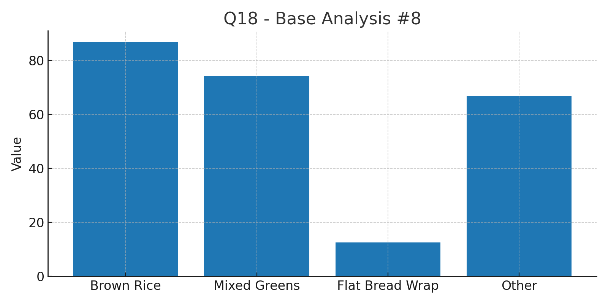

**SQL Query:**
```sql
SELECT base_type,
       COUNT(*) AS high_protein_items
FROM (
    SELECT *,
           CASE
             WHEN title ILIKE '%brown rice%' THEN 'Brown Rice'
             WHEN title ILIKE '%mixed greens%' THEN 'Mixed Greens'
             WHEN title ILIKE '%flat bread wrap%' THEN 'Flat Bread Wrap'
             ELSE 'Other'
           END AS base_type
    FROM food_desert_db.menu_items
    WHERE atl_food_place_id = 2
) AS t
WHERE protein_g >= 40
GROUP BY base_type;
```

**How to recreate (Jupyter - Seaborn / Matplotlib):**

1. Run the SQL query and load results into a pandas DataFrame `df`.
2. Example Python (adjust column names as needed):

```python
import pandas as pd
import seaborn as sns
import matplotlib.pyplot as plt

# df = result of SQL
sns.set(style='whitegrid')
plt.figure(figsize=(8,4))
# Example plotting: adjust for chart type
df_plot = df.copy()
sns.barplot(data=df_plot, x=df_plot.columns[1], y=df_plot.columns[0])
plt.title("Q18 - Base Analysis #8")
plt.tight_layout()
plt.savefig("mock_q18.png")
plt.show()
```
**How to recreate (Power BI):**

1. In Power BI Desktop, click *Get Data* → *PostgreSQL* or paste your SQL as a source.
2. Load the query result into the model.
3. In Report view, insert a visual that matches the recommended chart type (e.g., bar chart, scatter).
4. Drag fields to Axis/Values as needed, sort, and format colors and titles.
5. Export the visual as PNG via File → Export or use the snipping tool.
**How to recreate (Tableau):**

1. Connect to the PostgreSQL data source or load CSV of the SQL result.
2. Drag the relevant dimension to Rows and measure to Columns (or use Show Me → choose chart).
3. Use filters, sorting, and formatting to match the recommended visualization.
4. Export the worksheet as an image (Worksheet → Export → Image).

---

## 19. Q19 - Base Analysis #9
**Recommended chart type:** Pie

**Why:** Appropriate for comparing base categories

**Placeholder demo image:**

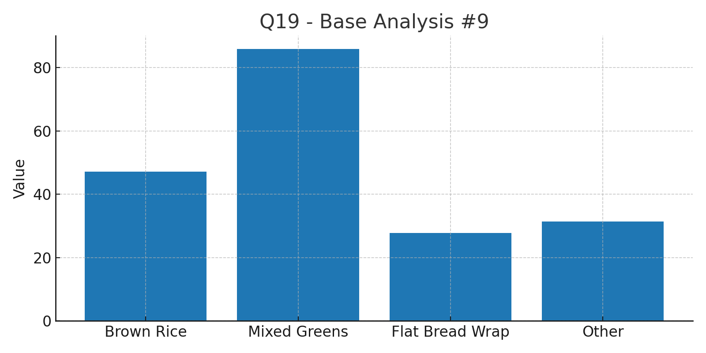

**SQL Query:**
```sql
SELECT base_type,
       ROUND(100.0 * SUM(CASE WHEN calories > 700 THEN 1 ELSE 0 END) / COUNT(*), 1)
         AS pct_high_cal
FROM (
    SELECT *,
           CASE
             WHEN title ILIKE '%brown rice%' THEN 'Brown Rice'
             WHEN title ILIKE '%mixed greens%' THEN 'Mixed Greens'
             WHEN title ILIKE '%flat bread wrap%' THEN 'Flat Bread Wrap'
             ELSE 'Other'
           END AS base_type
    FROM food_desert_db.menu_items
    WHERE atl_food_place_id = 2
) AS t
GROUP BY base_type;
```

**How to recreate (Jupyter - Seaborn / Matplotlib):**

1. Run the SQL query and load results into a pandas DataFrame `df`.
2. Example Python (adjust column names as needed):

```python
import pandas as pd
import seaborn as sns
import matplotlib.pyplot as plt

# df = result of SQL
sns.set(style='whitegrid')
plt.figure(figsize=(8,4))
# Example plotting: adjust for chart type
df_plot = df.copy()
sns.barplot(data=df_plot, x=df_plot.columns[1], y=df_plot.columns[0])
plt.title("Q19 - Base Analysis #9")
plt.tight_layout()
plt.savefig("mock_q19.png")
plt.show()
```
**How to recreate (Power BI):**

1. In Power BI Desktop, click *Get Data* → *PostgreSQL* or paste your SQL as a source.
2. Load the query result into the model.
3. In Report view, insert a visual that matches the recommended chart type (e.g., bar chart, scatter).
4. Drag fields to Axis/Values as needed, sort, and format colors and titles.
5. Export the visual as PNG via File → Export or use the snipping tool.
**How to recreate (Tableau):**

1. Connect to the PostgreSQL data source or load CSV of the SQL result.
2. Drag the relevant dimension to Rows and measure to Columns (or use Show Me → choose chart).
3. Use filters, sorting, and formatting to match the recommended visualization.
4. Export the worksheet as an image (Worksheet → Export → Image).

---

## 20. Q20 - Base Analysis #10
**Recommended chart type:** Horizontal Bar

**Why:** Appropriate for comparing base categories

**Placeholder demo image:**

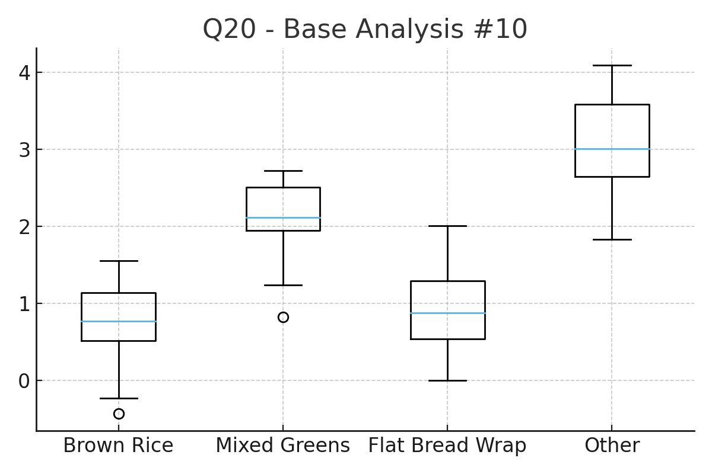

**SQL Query:**
```sql
SELECT base_type,
       ROUND(AVG(nutrition_score - GREATEST((calories - 600)/200.0,0)), 2)
           AS composite_score
FROM (
    SELECT *,
           CASE
             WHEN title ILIKE '%brown rice%' THEN 'Brown Rice'
             WHEN title ILIKE '%mixed greens%' THEN 'Mixed Greens'
             WHEN title ILIKE '%flat bread wrap%' THEN 'Flat Bread Wrap'
             ELSE 'Other'
           END AS base_type
    FROM food_desert_db.menu_items
    WHERE atl_food_place_id = 2
) AS t
GROUP BY base_type
ORDER BY composite_score DESC;
```

**How to recreate (Jupyter - Seaborn / Matplotlib):**

1. Run the SQL query and load results into a pandas DataFrame `df`.
2. Example Python (adjust column names as needed):

```python
import pandas as pd
import seaborn as sns
import matplotlib.pyplot as plt

# df = result of SQL
sns.set(style='whitegrid')
plt.figure(figsize=(8,4))
# Example plotting: adjust for chart type
df_plot = df.copy()
sns.barplot(data=df_plot, x=df_plot.columns[1], y=df_plot.columns[0])
plt.title("Q20 - Base Analysis #10")
plt.tight_layout()
plt.savefig("mock_q20.png")
plt.show()
```
**How to recreate (Power BI):**

1. In Power BI Desktop, click *Get Data* → *PostgreSQL* or paste your SQL as a source.
2. Load the query result into the model.
3. In Report view, insert a visual that matches the recommended chart type (e.g., bar chart, scatter).
4. Drag fields to Axis/Values as needed, sort, and format colors and titles.
5. Export the visual as PNG via File → Export or use the snipping tool.
**How to recreate (Tableau):**

1. Connect to the PostgreSQL data source or load CSV of the SQL result.
2. Drag the relevant dimension to Rows and measure to Columns (or use Show Me → choose chart).
3. Use filters, sorting, and formatting to match the recommended visualization.
4. Export the worksheet as an image (Worksheet → Export → Image).

---

## 21. Q21 - Product Type Analysis #1
**Recommended chart type:** Heatmap

**Why:** Product-family comparison

**Placeholder demo image:**

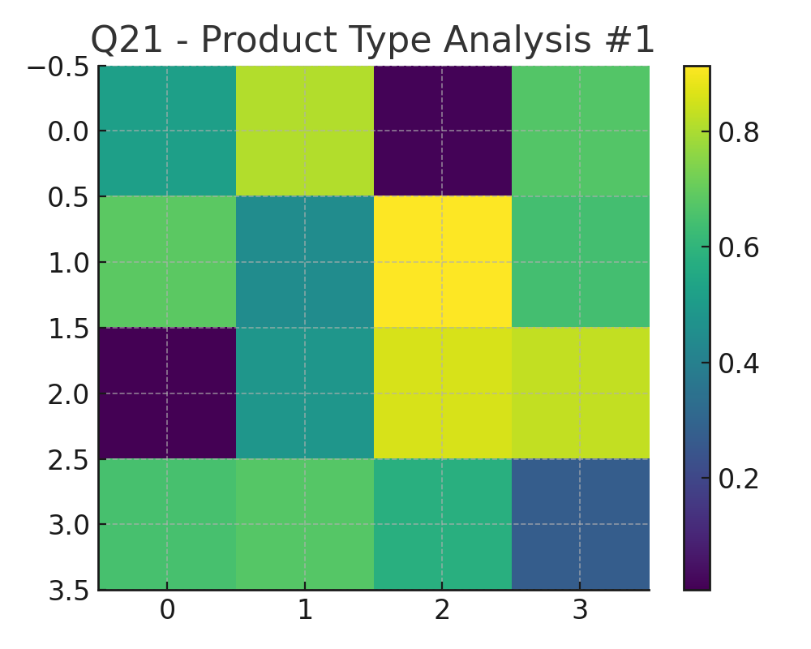

**SQL Query:**
```sql
SELECT product_type,
       ROUND(AVG(nutrition_score), 2) AS avg_nutrition_score
FROM (
    SELECT
        SPLIT_PART(title, '|', 1) AS product_type,
        nutrition_score
    FROM food_desert_db.menu_items
    WHERE atl_food_place_id = 2
) AS t
GROUP BY product_type
ORDER BY avg_nutrition_score DESC;
```

**How to recreate (Jupyter - Seaborn / Matplotlib):**

1. Run the SQL query and load results into a pandas DataFrame `df`.
2. Example Python (adjust column names as needed):

```python
import pandas as pd
import seaborn as sns
import matplotlib.pyplot as plt

# df = result of SQL
sns.set(style='whitegrid')
plt.figure(figsize=(8,4))
# Example plotting: adjust for chart type
df_plot = df.copy()
sns.barplot(data=df_plot, x=df_plot.columns[1], y=df_plot.columns[0])
plt.title("Q21 - Product Type Analysis #1")
plt.tight_layout()
plt.savefig("mock_q21.png")
plt.show()
```
**How to recreate (Power BI):**

1. In Power BI Desktop, click *Get Data* → *PostgreSQL* or paste your SQL as a source.
2. Load the query result into the model.
3. In Report view, insert a visual that matches the recommended chart type (e.g., bar chart, scatter).
4. Drag fields to Axis/Values as needed, sort, and format colors and titles.
5. Export the visual as PNG via File → Export or use the snipping tool.
**How to recreate (Tableau):**

1. Connect to the PostgreSQL data source or load CSV of the SQL result.
2. Drag the relevant dimension to Rows and measure to Columns (or use Show Me → choose chart).
3. Use filters, sorting, and formatting to match the recommended visualization.
4. Export the worksheet as an image (Worksheet → Export → Image).

---

## 22. Q22 - Product Type Analysis #2
**Recommended chart type:** Bar

**Why:** Product-family comparison

**Placeholder demo image:**

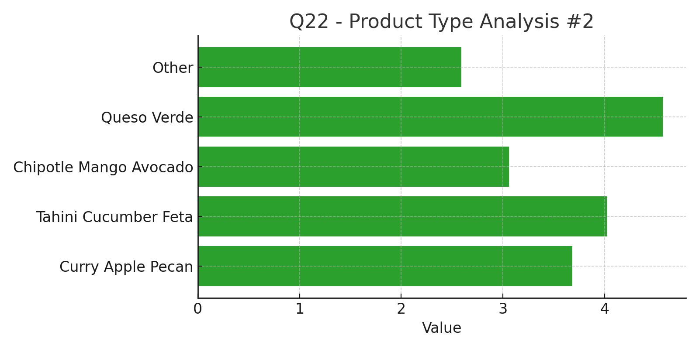

**SQL Query:**
```sql
SELECT product_type,
       COUNT(*) AS item_count
FROM (
    SELECT SPLIT_PART(title, '|', 1) AS product_type
    FROM food_desert_db.menu_items
    WHERE atl_food_place_id = 2
) AS t
GROUP BY product_type
ORDER BY item_count DESC;
```

**How to recreate (Jupyter - Seaborn / Matplotlib):**

1. Run the SQL query and load results into a pandas DataFrame `df`.
2. Example Python (adjust column names as needed):

```python
import pandas as pd
import seaborn as sns
import matplotlib.pyplot as plt

# df = result of SQL
sns.set(style='whitegrid')
plt.figure(figsize=(8,4))
# Example plotting: adjust for chart type
df_plot = df.copy()
sns.barplot(data=df_plot, x=df_plot.columns[1], y=df_plot.columns[0])
plt.title("Q22 - Product Type Analysis #2")
plt.tight_layout()
plt.savefig("mock_q22.png")
plt.show()
```
**How to recreate (Power BI):**

1. In Power BI Desktop, click *Get Data* → *PostgreSQL* or paste your SQL as a source.
2. Load the query result into the model.
3. In Report view, insert a visual that matches the recommended chart type (e.g., bar chart, scatter).
4. Drag fields to Axis/Values as needed, sort, and format colors and titles.
5. Export the visual as PNG via File → Export or use the snipping tool.
**How to recreate (Tableau):**

1. Connect to the PostgreSQL data source or load CSV of the SQL result.
2. Drag the relevant dimension to Rows and measure to Columns (or use Show Me → choose chart).
3. Use filters, sorting, and formatting to match the recommended visualization.
4. Export the worksheet as an image (Worksheet → Export → Image).

---

## 23. Q23 - Product Type Analysis #3
**Recommended chart type:** Top-3 List

**Why:** Product-family comparison

**Placeholder demo image:**

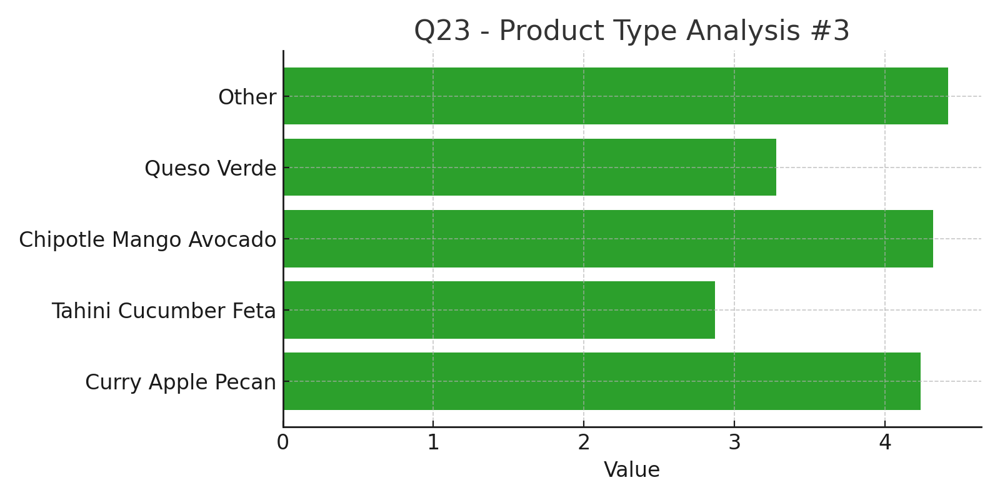

**SQL Query:**
```sql
SELECT product_type, title, nutrition_score
FROM (
    SELECT
        SPLIT_PART(title, '|', 1) AS product_type,
        title,
        nutrition_score,
        RANK() OVER (
            PARTITION BY SPLIT_PART(title, '|', 1)
            ORDER BY nutrition_score DESC
        ) AS rnk
    FROM food_desert_db.menu_items
    WHERE atl_food_place_id = 2
) AS t
WHERE rnk <= 3
ORDER BY product_type, rnk;
```

**How to recreate (Jupyter - Seaborn / Matplotlib):**

1. Run the SQL query and load results into a pandas DataFrame `df`.
2. Example Python (adjust column names as needed):

```python
import pandas as pd
import seaborn as sns
import matplotlib.pyplot as plt

# df = result of SQL
sns.set(style='whitegrid')
plt.figure(figsize=(8,4))
# Example plotting: adjust for chart type
df_plot = df.copy()
sns.barplot(data=df_plot, x=df_plot.columns[1], y=df_plot.columns[0])
plt.title("Q23 - Product Type Analysis #3")
plt.tight_layout()
plt.savefig("mock_q23.png")
plt.show()
```
**How to recreate (Power BI):**

1. In Power BI Desktop, click *Get Data* → *PostgreSQL* or paste your SQL as a source.
2. Load the query result into the model.
3. In Report view, insert a visual that matches the recommended chart type (e.g., bar chart, scatter).
4. Drag fields to Axis/Values as needed, sort, and format colors and titles.
5. Export the visual as PNG via File → Export or use the snipping tool.
**How to recreate (Tableau):**

1. Connect to the PostgreSQL data source or load CSV of the SQL result.
2. Drag the relevant dimension to Rows and measure to Columns (or use Show Me → choose chart).
3. Use filters, sorting, and formatting to match the recommended visualization.
4. Export the worksheet as an image (Worksheet → Export → Image).

---

## 24. Q24 - Product Type Analysis #4
**Recommended chart type:** Bottom-3 List

**Why:** Product-family comparison

**Placeholder demo image:**

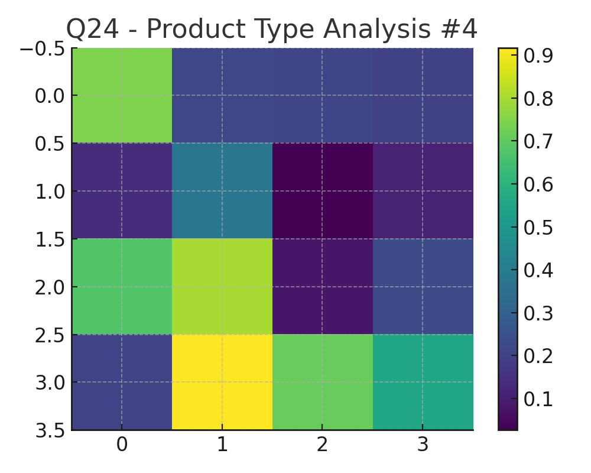

**SQL Query:**
```sql
SELECT product_type, title, nutrition_score
FROM (
    SELECT
        SPLIT_PART(title, '|', 1) AS product_type,
        title,
        nutrition_score,
        RANK() OVER (
            PARTITION BY SPLIT_PART(title, '|', 1)
            ORDER BY nutrition_score ASC
        ) AS rnk
    FROM food_desert_db.menu_items
    WHERE atl_food_place_id = 2
) AS t
WHERE rnk <= 3
ORDER BY product_type, rnk;
```

**How to recreate (Jupyter - Seaborn / Matplotlib):**

1. Run the SQL query and load results into a pandas DataFrame `df`.
2. Example Python (adjust column names as needed):

```python
import pandas as pd
import seaborn as sns
import matplotlib.pyplot as plt

# df = result of SQL
sns.set(style='whitegrid')
plt.figure(figsize=(8,4))
# Example plotting: adjust for chart type
df_plot = df.copy()
sns.barplot(data=df_plot, x=df_plot.columns[1], y=df_plot.columns[0])
plt.title("Q24 - Product Type Analysis #4")
plt.tight_layout()
plt.savefig("mock_q24.png")
plt.show()
```
**How to recreate (Power BI):**

1. In Power BI Desktop, click *Get Data* → *PostgreSQL* or paste your SQL as a source.
2. Load the query result into the model.
3. In Report view, insert a visual that matches the recommended chart type (e.g., bar chart, scatter).
4. Drag fields to Axis/Values as needed, sort, and format colors and titles.
5. Export the visual as PNG via File → Export or use the snipping tool.
**How to recreate (Tableau):**

1. Connect to the PostgreSQL data source or load CSV of the SQL result.
2. Drag the relevant dimension to Rows and measure to Columns (or use Show Me → choose chart).
3. Use filters, sorting, and formatting to match the recommended visualization.
4. Export the worksheet as an image (Worksheet → Export → Image).

---

## 25. Q25 - Product Type Analysis #5
**Recommended chart type:** Horizontal Bar

**Why:** Product-family comparison

**Placeholder demo image:**

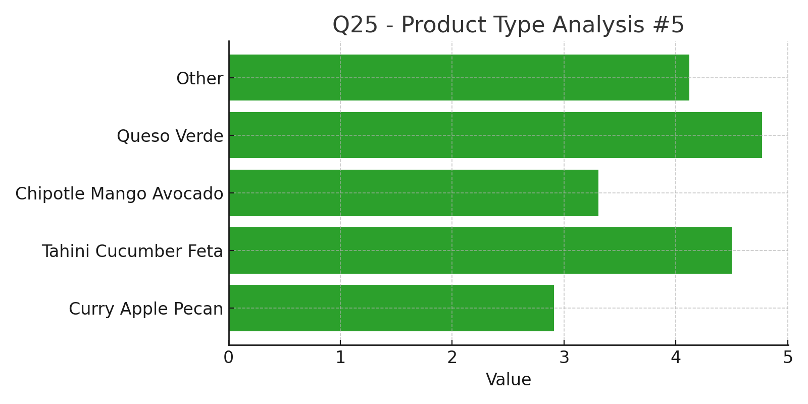

**SQL Query:**
```sql
SELECT product_type,
       ROUND(AVG(calories), 0) AS avg_calories
FROM (
    SELECT SPLIT_PART(title, '|', 1) AS product_type, calories
    FROM food_desert_db.menu_items
    WHERE atl_food_place_id = 2
) AS t
GROUP BY product_type
ORDER BY avg_calories;
```

**How to recreate (Jupyter - Seaborn / Matplotlib):**

1. Run the SQL query and load results into a pandas DataFrame `df`.
2. Example Python (adjust column names as needed):

```python
import pandas as pd
import seaborn as sns
import matplotlib.pyplot as plt

# df = result of SQL
sns.set(style='whitegrid')
plt.figure(figsize=(8,4))
# Example plotting: adjust for chart type
df_plot = df.copy()
sns.barplot(data=df_plot, x=df_plot.columns[1], y=df_plot.columns[0])
plt.title("Q25 - Product Type Analysis #5")
plt.tight_layout()
plt.savefig("mock_q25.png")
plt.show()
```
**How to recreate (Power BI):**

1. In Power BI Desktop, click *Get Data* → *PostgreSQL* or paste your SQL as a source.
2. Load the query result into the model.
3. In Report view, insert a visual that matches the recommended chart type (e.g., bar chart, scatter).
4. Drag fields to Axis/Values as needed, sort, and format colors and titles.
5. Export the visual as PNG via File → Export or use the snipping tool.
**How to recreate (Tableau):**

1. Connect to the PostgreSQL data source or load CSV of the SQL result.
2. Drag the relevant dimension to Rows and measure to Columns (or use Show Me → choose chart).
3. Use filters, sorting, and formatting to match the recommended visualization.
4. Export the worksheet as an image (Worksheet → Export → Image).

---

## 26. Q26 - Product Type Analysis #6
**Recommended chart type:** Scatter

**Why:** Product-family comparison

**Placeholder demo image:**

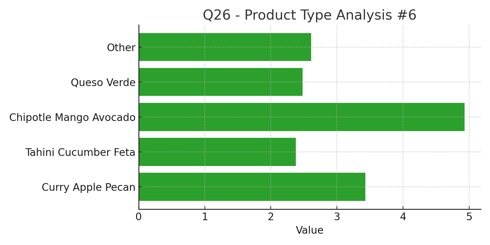

**SQL Query:**
```sql
SELECT product_type,
       title,
       ROUND(protein_g::numeric / calories, 3) AS protein_per_cal
FROM (
    SELECT
        SPLIT_PART(title, '|', 1) AS product_type,
        title,
        protein_g,
        calories,
        RANK() OVER (
            PARTITION BY SPLIT_PART(title, '|', 1)
            ORDER BY (protein_g::numeric / calories) DESC
        ) AS rnk
    FROM food_desert_db.menu_items
    WHERE atl_food_place_id = 2
) AS t
WHERE rnk = 1
ORDER BY product_type;
```

**How to recreate (Jupyter - Seaborn / Matplotlib):**

1. Run the SQL query and load results into a pandas DataFrame `df`.
2. Example Python (adjust column names as needed):

```python
import pandas as pd
import seaborn as sns
import matplotlib.pyplot as plt

# df = result of SQL
sns.set(style='whitegrid')
plt.figure(figsize=(8,4))
# Example plotting: adjust for chart type
df_plot = df.copy()
sns.barplot(data=df_plot, x=df_plot.columns[1], y=df_plot.columns[0])
plt.title("Q26 - Product Type Analysis #6")
plt.tight_layout()
plt.savefig("mock_q26.png")
plt.show()
```
**How to recreate (Power BI):**

1. In Power BI Desktop, click *Get Data* → *PostgreSQL* or paste your SQL as a source.
2. Load the query result into the model.
3. In Report view, insert a visual that matches the recommended chart type (e.g., bar chart, scatter).
4. Drag fields to Axis/Values as needed, sort, and format colors and titles.
5. Export the visual as PNG via File → Export or use the snipping tool.
**How to recreate (Tableau):**

1. Connect to the PostgreSQL data source or load CSV of the SQL result.
2. Drag the relevant dimension to Rows and measure to Columns (or use Show Me → choose chart).
3. Use filters, sorting, and formatting to match the recommended visualization.
4. Export the worksheet as an image (Worksheet → Export → Image).

---

## 27. Q27 - Product Type Analysis #7
**Recommended chart type:** Stacked Bar

**Why:** Product-family comparison

**Placeholder demo image:**

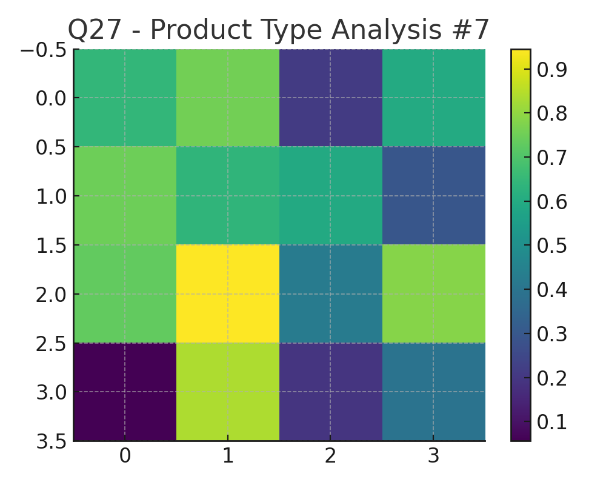

**SQL Query:**
```sql
SELECT product_type,
       ROUND(100.0 * SUM(CASE WHEN nutrition_score >= 4 THEN 1 ELSE 0 END) / COUNT(*), 1)
           AS pct_high_nutrition
FROM (
    SELECT SPLIT_PART(title, '|', 1) AS product_type,
           nutrition_score
    FROM food_desert_db.menu_items
    WHERE atl_food_place_id = 2
) AS t
GROUP BY product_type
ORDER BY pct_high_nutrition DESC;
```

**How to recreate (Jupyter - Seaborn / Matplotlib):**

1. Run the SQL query and load results into a pandas DataFrame `df`.
2. Example Python (adjust column names as needed):

```python
import pandas as pd
import seaborn as sns
import matplotlib.pyplot as plt

# df = result of SQL
sns.set(style='whitegrid')
plt.figure(figsize=(8,4))
# Example plotting: adjust for chart type
df_plot = df.copy()
sns.barplot(data=df_plot, x=df_plot.columns[1], y=df_plot.columns[0])
plt.title("Q27 - Product Type Analysis #7")
plt.tight_layout()
plt.savefig("mock_q27.png")
plt.show()
```
**How to recreate (Power BI):**

1. In Power BI Desktop, click *Get Data* → *PostgreSQL* or paste your SQL as a source.
2. Load the query result into the model.
3. In Report view, insert a visual that matches the recommended chart type (e.g., bar chart, scatter).
4. Drag fields to Axis/Values as needed, sort, and format colors and titles.
5. Export the visual as PNG via File → Export or use the snipping tool.
**How to recreate (Tableau):**

1. Connect to the PostgreSQL data source or load CSV of the SQL result.
2. Drag the relevant dimension to Rows and measure to Columns (or use Show Me → choose chart).
3. Use filters, sorting, and formatting to match the recommended visualization.
4. Export the worksheet as an image (Worksheet → Export → Image).

---

## 28. Q28 - Product Type Analysis #8
**Recommended chart type:** Horizontal Bar

**Why:** Product-family comparison

**Placeholder demo image:**

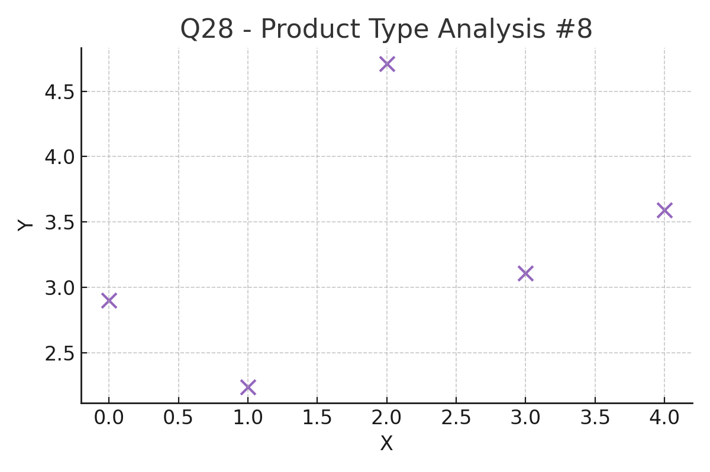

**SQL Query:**
```sql
SELECT product_type,
       ROUND(AVG(sodium_mg), 0) AS avg_sodium_mg
FROM (
    SELECT SPLIT_PART(title, '|', 1) AS product_type, sodium_mg
    FROM food_desert_db.menu_items
    WHERE atl_food_place_id = 2
) AS t
GROUP BY product_type
ORDER BY avg_sodium_mg;
```

**How to recreate (Jupyter - Seaborn / Matplotlib):**

1. Run the SQL query and load results into a pandas DataFrame `df`.
2. Example Python (adjust column names as needed):

```python
import pandas as pd
import seaborn as sns
import matplotlib.pyplot as plt

# df = result of SQL
sns.set(style='whitegrid')
plt.figure(figsize=(8,4))
# Example plotting: adjust for chart type
df_plot = df.copy()
sns.barplot(data=df_plot, x=df_plot.columns[1], y=df_plot.columns[0])
plt.title("Q28 - Product Type Analysis #8")
plt.tight_layout()
plt.savefig("mock_q28.png")
plt.show()
```
**How to recreate (Power BI):**

1. In Power BI Desktop, click *Get Data* → *PostgreSQL* or paste your SQL as a source.
2. Load the query result into the model.
3. In Report view, insert a visual that matches the recommended chart type (e.g., bar chart, scatter).
4. Drag fields to Axis/Values as needed, sort, and format colors and titles.
5. Export the visual as PNG via File → Export or use the snipping tool.
**How to recreate (Tableau):**

1. Connect to the PostgreSQL data source or load CSV of the SQL result.
2. Drag the relevant dimension to Rows and measure to Columns (or use Show Me → choose chart).
3. Use filters, sorting, and formatting to match the recommended visualization.
4. Export the worksheet as an image (Worksheet → Export → Image).

---

## 29. Q29 - Product Type Analysis #9
**Recommended chart type:** Composite Bar

**Why:** Product-family comparison

**Placeholder demo image:**

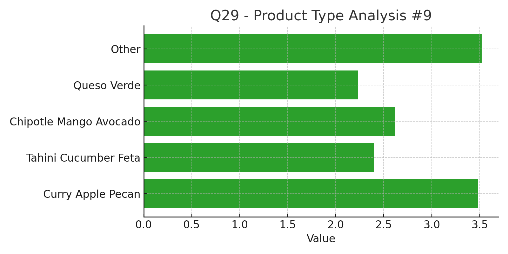

**SQL Query:**
```sql
SELECT product_type,
       ROUND(AVG(nutrition_score - GREATEST((calories - 600)/200.0, 0)), 2)
           AS composite_score
FROM (
    SELECT SPLIT_PART(title, '|', 1) AS product_type,
           nutrition_score,
           calories
    FROM food_desert_db.menu_items
    WHERE atl_food_place_id = 2
) AS t
GROUP BY product_type
ORDER BY composite_score DESC;
```

**How to recreate (Jupyter - Seaborn / Matplotlib):**

1. Run the SQL query and load results into a pandas DataFrame `df`.
2. Example Python (adjust column names as needed):

```python
import pandas as pd
import seaborn as sns
import matplotlib.pyplot as plt

# df = result of SQL
sns.set(style='whitegrid')
plt.figure(figsize=(8,4))
# Example plotting: adjust for chart type
df_plot = df.copy()
sns.barplot(data=df_plot, x=df_plot.columns[1], y=df_plot.columns[0])
plt.title("Q29 - Product Type Analysis #9")
plt.tight_layout()
plt.savefig("mock_q29.png")
plt.show()
```
**How to recreate (Power BI):**

1. In Power BI Desktop, click *Get Data* → *PostgreSQL* or paste your SQL as a source.
2. Load the query result into the model.
3. In Report view, insert a visual that matches the recommended chart type (e.g., bar chart, scatter).
4. Drag fields to Axis/Values as needed, sort, and format colors and titles.
5. Export the visual as PNG via File → Export or use the snipping tool.
**How to recreate (Tableau):**

1. Connect to the PostgreSQL data source or load CSV of the SQL result.
2. Drag the relevant dimension to Rows and measure to Columns (or use Show Me → choose chart).
3. Use filters, sorting, and formatting to match the recommended visualization.
4. Export the worksheet as an image (Worksheet → Export → Image).

---

## 30. Q30 - Product Type Analysis #10
**Recommended chart type:** Table/List

**Why:** Product-family comparison

**Placeholder demo image:**

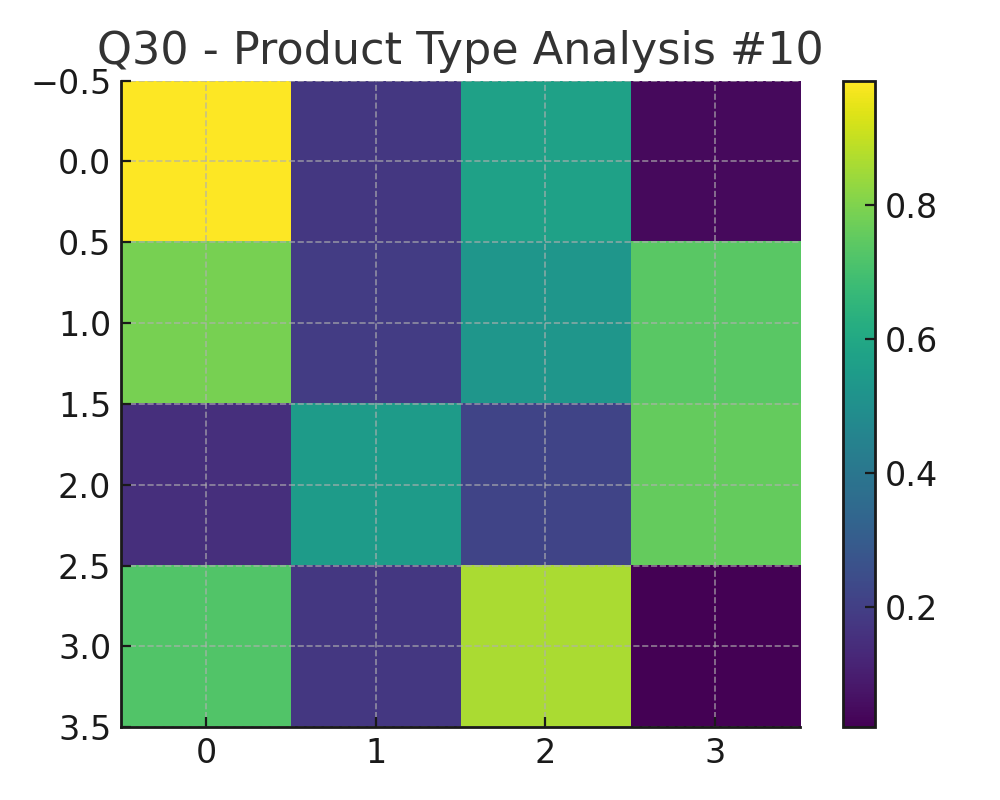

**SQL Query:**
```sql
SELECT product_type,
       COUNT(DISTINCT
             CASE
                 WHEN title ILIKE '%tofu%' THEN 'Tofu'
                 WHEN title ILIKE '%spicy chicken%' THEN 'Grilled Spicy Chicken'
                 WHEN title ILIKE '%grilled chicken%' THEN 'Grilled Chicken'
                 ELSE 'Other'
             END) AS distinct_protein_types
FROM (
    SELECT SPLIT_PART(title, '|', 1) AS product_type,
           title
    FROM food_desert_db.menu_items
    WHERE atl_food_place_id = 2
) AS t
GROUP BY product_type
ORDER BY distinct_protein_types DESC;
```

**How to recreate (Jupyter - Seaborn / Matplotlib):**

1. Run the SQL query and load results into a pandas DataFrame `df`.
2. Example Python (adjust column names as needed):

```python
import pandas as pd
import seaborn as sns
import matplotlib.pyplot as plt

# df = result of SQL
sns.set(style='whitegrid')
plt.figure(figsize=(8,4))
# Example plotting: adjust for chart type
df_plot = df.copy()
sns.barplot(data=df_plot, x=df_plot.columns[1], y=df_plot.columns[0])
plt.title("Q30 - Product Type Analysis #10")
plt.tight_layout()
plt.savefig("mock_q30.png")
plt.show()
```
**How to recreate (Power BI):**

1. In Power BI Desktop, click *Get Data* → *PostgreSQL* or paste your SQL as a source.
2. Load the query result into the model.
3. In Report view, insert a visual that matches the recommended chart type (e.g., bar chart, scatter).
4. Drag fields to Axis/Values as needed, sort, and format colors and titles.
5. Export the visual as PNG via File → Export or use the snipping tool.
**How to recreate (Tableau):**

1. Connect to the PostgreSQL data source or load CSV of the SQL result.
2. Drag the relevant dimension to Rows and measure to Columns (or use Show Me → choose chart).
3. Use filters, sorting, and formatting to match the recommended visualization.
4. Export the worksheet as an image (Worksheet → Export → Image).

---

